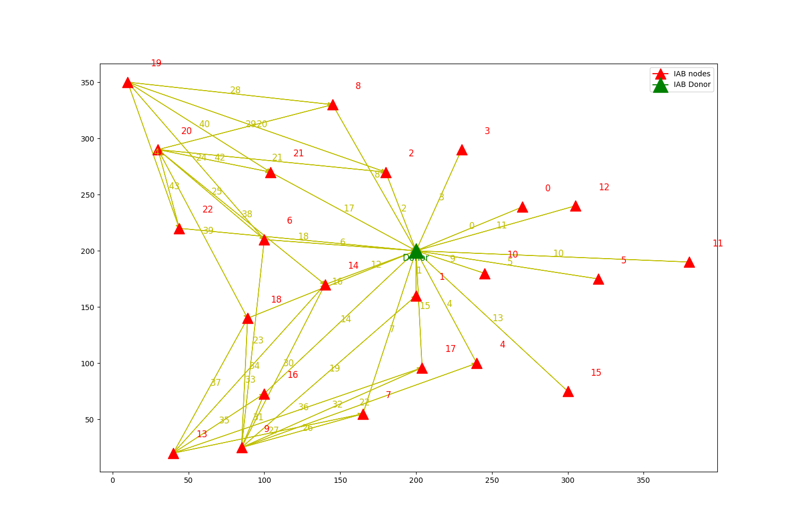
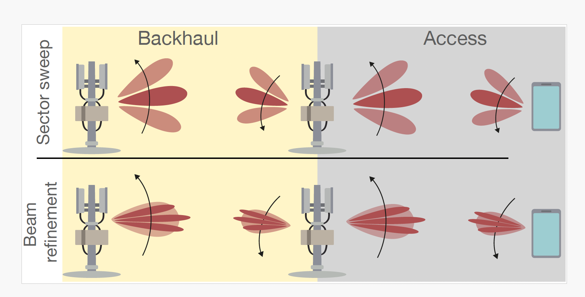
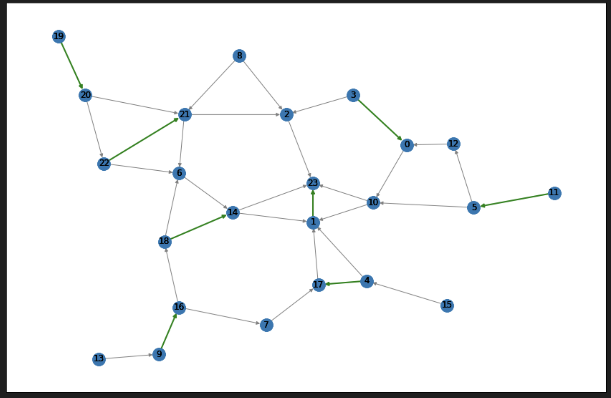

# ---- SEBASI IAB Simulator v1.0. ----

-- System-level Integrated Access and Backhaul simulator for self-backhauling on Top of Sionna Simulator

-- Author: Amir Ashtari Gargari

-- e-mail: amirashtari.1374@gmail.com

## News
SeBaSi Simulator is used in NASA's IAB project (4 Feb 2025). 

##  Important information

If you are using this simulator (or parts of it) for a publication, then you must cite the following paper:

A. A. Gargari et al., "Safehaul: Risk-Averse Learning for Reliable mmWave Self-Backhauling in 6G Networks," IEEE INFOCOM 2023 - IEEE Conference on Computer Communications, New York City, NY, USA, 2023, pp. 1-10, doi: 10.1109/INFOCOM53939.2023.10228969.

##  How to start a simulation 
To run example Demo run Ex1.py

You have to call Simulator from SEBASI file
for example:

` network_simulator = Simulator(simulation_time_steps=160, num_ue=100, mode="run", source_rate=50,
                               topology="smallMap", scheduler="mlr", packet_size=1, channel_update_ON =False) `

You can set simulation run time, Topology (supported smallMap, Padova or any custom map), Backhual Scheduler, packet size in Mb, 
channel_update_ON indicates in each transmission channel model is expired and have to recalculate.
you can see IAB deployment and routing figure which saved in Example Directory

by calling Run method simulation will start:

` network_simulator.run()` 

You can do post processing to print KPI, such as THU, Latency.
`post_processing(network_simulator) ` 

## Features 

- Supported Self backhualing scheduler: 
    - Main.Scheduler.path_select_distance_sinr (known as MLR) Approch which choose link with - highest Sinr and path capacity.
    - Main.Scheduler.path_select_rand: Random scheduler to be used as benchmark
- Supported Scheduler: 
    - Main.Scheduler.round_robin_scheduler Round Robin Scehduler
- Supported Pre_filter_Routing:
    - Main.Routing.distance_aware_path_generation: generate path based on max possible distance
    - Main.Routing.section_aware_path_generation: generate path based on tiers
 
    (why we need pre filter routing? In theory it is possible to check all possible paths in each bachkual transmission of IAB's. But in real world and dense deployment it is not efficnt and recommeneded. Pre transmiision filter indicates all possible/ good cnadidates for each IAB to choose for backhauling results in lower latency, complexity and power consumption to find best path in time of transmission. for example if your network contains 101 IAB nodes you need to calculate channel 101 * 100 times to find best routing for each IAB, but if you apply prefilter you might have 101*5 channel calculation (95% reduction))
- Supported UE Attachment:
  - Distance based attachment

## Future work 
we are working on most of this features to include them in the next release:

- 2 step beamforming model 

- Multi IAB scenario Support
- Advance Debug Mode

- Resiliency test Mode
- RSRP User association
- PF scheduler

